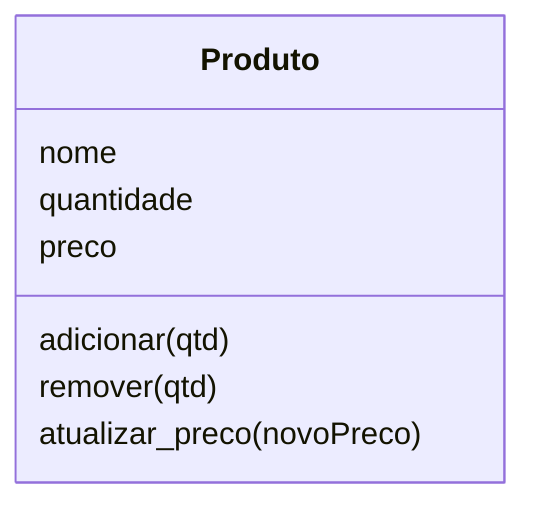
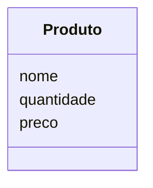

# Capítulo 2 – Classes e Objetos em Python

No capítulo anterior, você aprendeu a observar um problema de forma diferente.

Em vez de pensar apenas em funções e etapas, passou a identificar:

- elementos do sistema
- dados associados a esses elementos
- ações que cada elemento deve realizar

Ao final, chegamos a um modelo como este:



---

## 🧠 **Um novo desafio**

Até agora, tudo foi feito no nível conceitual.

Mas surge uma pergunta importante:

> 👉 **como transformar esse modelo em código Python?**
> 

---

## 🧩 **Do modelo para a implementação**

Se no capítulo anterior organizamos o problema, agora vamos:

- criar estruturas em Python
- representar entidades como código
- transformar ações em métodos

---

## 🎯 **O foco deste capítulo**

Neste capítulo, você irá aprender a:

- criar classes em Python
- instanciar objetos
- definir atributos
- implementar métodos
- organizar dados e comportamentos em uma única estrutura

---

## 💡 **Importante**

Neste momento, o objetivo não é criar um sistema perfeito.

É entender como:

> 👉 **um modelo se transforma em código funcional**
> 

---

## 🧱 **Evolução natural**

Se no Capítulo 1 você construiu a base conceitual, agora você dará o próximo passo:

```
modelo → classe → objeto
```

---

## 🚀 **Preparado para implementar?**

Agora vamos começar criando a primeira representação em código daquilo que antes existia apenas como modelo.

## 📌 **2.1 Criando a primeira classe**

No capítulo anterior, construímos um modelo para representar um elemento do sistema.

Agora, vamos dar o próximo passo:

> 👉 **transformar esse modelo em código Python**
> 

---

## 🧠 **O que é uma classe?**

Uma classe é a forma que usamos em Python para representar um modelo.

> 👉 Ela define a estrutura de um objeto
> 

---

## 🧩 **Primeira implementação**

Vamos começar criando a estrutura mais simples possível:

```python
class Produto:
    pass
```

---

## 🔍 **Entendendo o código**

- `class` → palavra-chave para definir uma classe
- `Produto` → nome da classe (representa o modelo)
- `pass` → indica que a classe está vazia (por enquanto)

---

## 💡 **Importante**

Neste momento:

- ainda não temos dados
- ainda não temos comportamentos
- apenas criamos a estrutura

---

## 🧠 **Relação com o capítulo anterior**

No Capítulo 1, definimos um modelo como:


Agora, estamos começando a representar esse modelo em código.

---

## ⚠️ **Por que começar vazio?**

Porque queremos construir a classe **passo a passo**, entendendo cada parte.

Se adicionarmos tudo de uma vez, pode ficar confuso.

---

## 🎯 **Resumo da seção**

- Classe é a representação de um modelo em código
- Usamos `class` para definir uma classe em Python
- Uma classe pode começar vazia
- Vamos evoluí-la gradualmente nas próximas seções

## 📌 **2.2 Criando objetos (instância)**

Agora que temos uma classe, surge uma pergunta importante:

> 👉 **como utilizamos essa classe na prática?**
> 

---

## 🧠 **Classe vs Objeto**

A classe define o modelo, mas ela não representa um elemento real por si só.

Para isso, precisamos criar um:

> 👉 **objeto**
> 

---

## 🧩 **O que é um objeto?**

Um objeto é uma **instância da classe**.

Ou seja:

- a classe define
- o objeto representa algo concreto

---

## 📘 **Criando um objeto**

```python
produto = Produto()
```

---

## 🔍 **Entendendo o código**

- `Produto()` → cria um novo objeto baseado na classe
- `produto` → variável que armazena esse objeto

---

## 🧠 **Relacionando com o modelo**

```
Classe → Produto
Objeto → produto
```

---

## 💡 **Importante**

Você pode criar vários objetos a partir da mesma classe:

```python
produto1 = Produto()
produto2 = Produto()
produto3 = Produto()
```

Cada um deles é independente.

---

## 🎯 **O que temos até agora**

- criamos uma classe
- criamos objetos a partir dela

Mas ainda falta algo importante:

> 👉 nossos objetos ainda não possuem dados
> 

---

## 🧠 **Resumo da seção**

- Objetos são instâncias de uma classe
- Usamos `Classe()` para criar um objeto
- Uma classe pode gerar vários objetos
- Cada objeto é independente

## 📌 **2.3 Atributos**

Até agora, conseguimos:

- criar uma classe
- criar objetos a partir dela

Mas nossos objetos ainda não possuem informações.

---

## 🧠 **O que são atributos?**

Atributos são:

> 👉 **os dados que pertencem a um objeto**
> 

---

## 🧩 **Adicionando atributos**

Em Python, podemos adicionar atributos diretamente ao objeto:

```python
produto = Produto()

produto.nome = "Arroz"
produto.quantidade = 10
produto.preco = 5.0
```

---

## 🔍 **O que está acontecendo?**

Agora o objeto `produto` possui:

- `nome`
- `quantidade`
- `preco`

Esses são os atributos do objeto.

---

## 🧠 **Relacionando com o modelo**



Agora esses dados existem dentro do objeto.

---

## 📘 **Acessando atributos**

Podemos acessar os valores assim:

```python
print(produto.nome)
print(produto.quantidade)
print(produto.preco)
```

---

## ⚠️ **Ponto importante**

Embora funcione, essa forma tem um problema:

- os atributos podem ser criados em qualquer momento
- não há controle sobre os valores
- diferentes objetos podem ter estruturas diferentes

---

## 🧩 **Exemplo de problema**

```python
produto2 = Produto()
produto2.nome = "Feijão"
```

Nesse caso:

- `produto2` não possui `quantidade` nem `preco`

👉 Isso pode gerar inconsistência no sistema.

---

## 💡 **Conclusão**

Adicionar atributos diretamente funciona, mas não é a melhor abordagem.

Precisamos de uma forma de:

- garantir que todo objeto tenha os mesmos dados
- inicializar os atributos corretamente

---

## 🧠 **Resumo da seção**

- Atributos são os dados de um objeto
- Podem ser adicionados dinamicamente em Python
- Essa abordagem é simples, mas não segura
- Precisamos de uma forma melhor de inicialização

## 📌 **2.4 Método construtor (`__init__`)**

Na seção anterior, vimos que é possível adicionar atributos diretamente aos objetos.

No entanto, isso pode gerar problemas:

- objetos incompletos
- dados inconsistentes
- falta de padronização

---

## 🧠 **Uma solução melhor**

Precisamos garantir que todo objeto:

- seja criado com os dados necessários
- tenha uma estrutura consistente

Para isso, utilizamos o:

> 👉 **método construtor**
> 

---

## 🧩 **O que é o construtor?**

O construtor é um método especial executado automaticamente quando um objeto é criado.

Em Python, ele é definido como:

```python
def __init__(self, ...):
```

---

## 📘 **Implementando na classe**

```python
class Produto:
    def __init__(self, nome, quantidade, preco):
        self.nome = nome
        self.quantidade = quantidade
        self.preco = preco
```

---

## 🔍 **Entendendo o código**

- `__init__` → método chamado automaticamente na criação do objeto
- `self` → representa o próprio objeto
- `nome`, `quantidade`, `preco` → dados recebidos na criação
- `self.nome`, `self.quantidade`, `self.preco` → atributos do objeto

---

## 🧩 **Criando um objeto com construtor**

```python
produto = Produto("Arroz", 10, 5.0)
```

Agora, o objeto já nasce com todos os dados definidos.

---

## 💡 **Vantagens**

- todos os objetos têm a mesma estrutura
- evita esquecimentos
- melhora a organização
- torna o código mais confiável

---

## ⚠️ **Comparação com antes**

Antes:

```python
produto = Produto()
produto.nome = "Arroz"
```

Agora:

```python
produto = Produto("Arroz", 10, 5.0)
```

👉 Muito mais organizado.

---

## 🧠 **Resumo da seção**

- O construtor inicializa o objeto
- É executado automaticamente
- Garante consistência dos dados
- Define os atributos no momento da criação

## 📌 **2.5 O papel do `self`**

Ao implementar o construtor, utilizamos um elemento que merece atenção especial:

```python
def __init__(self, nome, quantidade, preco):
```

> 👉 o `self`
> 

---

## 🧠 **O que é `self`?**

O `self` representa:

> 👉 **o próprio objeto que está sendo manipulado**
> 

---

## 🔍 **Entendendo na prática**

Quando criamos um objeto:

```python
produto = Produto("Arroz", 10, 5.0)
```

Internamente, o Python faz algo equivalente a:

```
Produto.__init__(produto, "Arroz", 10, 5.0)
```

Ou seja:

- `self` → recebe o próprio objeto (`produto`)

---

## 🧩 **Por que isso é necessário?**

O `self` permite que o objeto:

- armazene seus próprios dados
- acesse seus atributos
- execute seus próprios métodos

---

## 📘 **Exemplo com atributos**

```python
self.nome = nome
```

Significa:

- `self.nome` → atributo do objeto
- `nome` → valor recebido como parâmetro

---

## ⚠️ **Sem `self`, não funciona**

```python
def __init__(nome, quantidade, preco):
    nome = nome
```

👉 Aqui não estamos salvando o valor no objeto, apenas manipulando variáveis locais.

---

## 🧠 **Diferença importante**

```
nome → variável local
self.nome → atributo do objeto
```

---

## 💡 **Regra prática**

Sempre que quiser:

- armazenar dados no objeto
- acessar atributos
- chamar métodos da própria classe

👉 você deve usar `self`

---

## 🧩 **Exemplo completo**

```python
class Produto:
    def __init__(self, nome, quantidade, preco):
        self.nome = nome
        self.quantidade = quantidade
        self.preco = preco
```

Cada objeto criado terá seus próprios valores.

---

## 🧠 **Resumo da seção**

- `self` representa o próprio objeto
- Permite acessar e modificar atributos
- Diferencia variáveis locais de dados do objeto
- É essencial em métodos de classe

## 📌 **2.6 Métodos de instância**

Até agora, conseguimos:

- definir uma classe
- criar objetos
- armazenar dados nos objetos

Agora precisamos dar o próximo passo:

> 👉 **definir ações que o objeto pode realizar**
> 

---

## 🧠 **O que são métodos?**

Métodos são:

> 👉 **funções que pertencem a uma classe**
> 

Eles definem o comportamento dos objetos.

---

## 🧩 **Adicionando um método**

Vamos adicionar uma ação à classe:

```python
class Produto:
    def __init__(self, nome, quantidade, preco):
        self.nome = nome
        self.quantidade = quantidade
        self.preco = preco

    def adicionar(self, qtd):
        self.quantidade += qtd
```

---

## 🔍 **Entendendo o método**

- `def adicionar(self, qtd)` → método da classe
- `self` → objeto que está executando o método
- `qtd` → valor recebido
- `self.quantidade += qtd` → altera o estado do objeto

---

## 📘 **Utilizando o método**

```python
produto = Produto("Arroz", 10, 5.0)

produto.adicionar(5)

print(produto.quantidade)
```

Saída:

```
15
```

---

## 🧠 **O que mudou?**

Antes:

```python
produto["quantidade"] += 5
```

Agora:

```python
produto.adicionar(5)
```

👉 O próprio objeto controla a alteração.

---

## 💡 **Vantagem principal**

As regras passam a ficar dentro da classe.

Isso permite:

- maior organização
- centralização de comportamento
- melhor controle dos dados

---

## 🧩 **Adicionando outro método**

```python
def remover(self, qtd):
    self.quantidade -= qtd
```

---

## ⚠️ **Observação importante**

Neste momento, ainda não estamos validando os dados.

Isso será tratado no próximo capítulo.

---

## 🧠 **Resumo da seção**

- Métodos são funções dentro da classe
- Definem o comportamento dos objetos
- Utilizam `self` para acessar os dados
- Permitem modificar o estado do objeto

## 📌 **2.7 Organizando dados e comportamentos**

Agora que já conhecemos:

- atributos (dados)
- métodos (ações)

podemos organizar tudo em uma única estrutura.

---

## 🧠 **Classe completa**

```python
class Produto:
    def __init__(self, nome, quantidade, preco):
        self.nome = nome
        self.quantidade = quantidade
        self.preco = preco

    def adicionar(self, qtd):
        self.quantidade += qtd

    def remover(self, qtd):
        self.quantidade -= qtd

    def atualizar_preco(self, novo_preco):
        self.preco = novo_preco
```

---

## 🔍 **O que temos aqui**

Essa classe reúne:

### 🔹 Dados

- `nome`
- `quantidade`
- `preco`

### 🔹 Comportamentos

- `adicionar()`
- `remover()`
- `atualizar_preco()`

---

## 🧩 **Utilizando a classe**

```python
produto = Produto("Arroz", 10, 5.0)

produto.adicionar(5)
produto.remover(3)
produto.atualizar_preco(6.0)

print(produto.quantidade)
print(produto.preco)
```

---

## 🧠 **Relação com o modelo**

No Capítulo 1, construímos:


Agora, esse modelo foi transformado em código.

---

## 💡 **O que mudou em relação ao procedural**

Antes:

- dados em estruturas externas
- funções separadas

Agora:

- dados e comportamentos juntos
- responsabilidade dentro da classe

---

## 🎯 **Resultado**

- código mais organizado
- regras centralizadas
- maior clareza
- facilidade de manutenção

---

## 🧠 **Resumo da seção**

- Uma classe reúne dados e comportamentos
- O modelo foi implementado em código
- A organização melhora significativamente
- Cada objeto controla seu próprio estado

## 📌 **2.8 Representação de objetos (`__str__`)**

Até agora, aprendemos a:

- criar classes
- definir atributos
- implementar métodos
- utilizar objetos

Com isso, já conseguimos acessar e exibir informações específicas:

```python
produto = Produto("Arroz", 10, 5.0)

print(produto.nome)
print(produto.quantidade)
```

---

## 🧠 **Mas e se quisermos exibir o objeto inteiro?**

Vamos tentar:

```python
print(produto)
```

Saída:

```
<__main__.Produto object at 0x...>
```

---

## ⚠️ **Problema**

Essa saída:

- não é intuitiva
- não mostra os dados do objeto
- não é útil para o usuário

👉 Ou seja, o Python não sabe **como representar nosso objeto de forma amigável**.

---

## 💡 **Como resolver isso?**

Podemos ensinar ao Python como exibir o objeto utilizando um método especial:

```python
def __str__(self):
```

---

## 🧩 **Implementando na classe**

```python
class Produto:
    def __init__(self, nome, quantidade, preco):
        self.nome = nome
        self.quantidade = quantidade
        self.preco = preco

    def __str__(self):
        return f"{self.nome} | Qtd: {self.quantidade} | R$ {self.preco}"
```

---

## 🧪 **Agora veja o resultado**

```python
produto = Produto("Arroz", 10, 5.0)

print(produto)
```

Saída:

```
Arroz | Qtd: 10 | R$ 5.0
```

---

## 🔍 **O que aconteceu aqui?**

- O Python chamou automaticamente o método `__str__`
- O valor retornado por esse método foi exibido no `print()`
- Agora o objeto possui uma representação mais clara

---

## 💡 **Vantagens**

- melhora a leitura do código
- facilita depuração (debug)
- torna a saída mais amigável
- aproxima o comportamento do objeto ao mundo real

---

## 🎯 **Quando usar isso?**

Sempre que fizer sentido exibir um objeto de forma clara, como:

- listagem de dados
- mensagens no sistema
- logs e depuração

---

## 🧠 **Resumo da seção**

- Objetos possuem uma representação padrão pouco útil
- Podemos personalizar essa representação com `__str__`
- O método é chamado automaticamente pelo `print()`
- Isso torna o uso dos objetos mais claro e intuitivo

---

## 📌 **2.9 Trabalhando com múltiplos objetos**

Até agora, utilizamos apenas um objeto.

Mas em um sistema real, precisamos trabalhar com vários elementos ao mesmo tempo.

---

## 🧠 **Criando múltiplos objetos**

```python
produto1 = Produto("Arroz", 10, 5.0)
produto2 = Produto("Feijão", 20, 7.0)
produto3 = Produto("Macarrão", 15, 4.5)
```

Cada objeto:

- possui seus próprios dados
- funciona de forma independente

---

## 🧩 **Organizando em uma lista**

Podemos armazenar os objetos em uma lista:

```python
produtos = [produto1, produto2, produto3]
```

---

## 🔍 **Percorrendo os objetos**

```python
for produto in produtos:
    print(produto.nome, produto.quantidade)
```

---

## 🧠 **Aplicando métodos em lote**

```python
for produto in produtos:
    produto.adicionar(5)
```

👉 Todos os produtos terão sua quantidade atualizada.

---

## 💡 **Por que isso é importante?**

Permite:

- trabalhar com conjuntos de objetos
- aplicar operações em vários elementos
- simular cenários reais

---

## ⚠️ **Observação**

Cada objeto mantém seu próprio estado:

```python
produto1.adicionar(10)
```

👉 Apenas `produto1` será alterado.

---

## 🧠 **Resumo da seção**

- Um sistema possui vários objetos
- Podemos armazená-los em listas
- É possível iterar e aplicar operações
- Cada objeto continua independente

## 📌 **2.10 Referências de objetos e comparação**

Ao trabalhar com múltiplos objetos, é importante entender como eles são manipulados pelas variáveis.

---

## 🧠 **Atribuição não cria cópia**

Considere o exemplo:

```python
produto1 = Produto("Arroz", 10, 5.0)
produto2 = produto1
```

Agora temos duas variáveis:

- `produto1`
- `produto2`

---

## 🔍 **O que isso significa?**

Ambas as variáveis apontam para o **mesmo objeto**.

```
produto1 ─┐
          ├──► objeto Produto
produto2 ─┘
```

---

## 🧩 **Testando na prática**

```python
produto2.adicionar(5)

print(produto1.quantidade)
```

Saída:

```
15
```

👉 Alterar `produto2` também altera `produto1`.

---

## 💡 **Por quê?**

Porque:

> 👉 não foi criada uma cópia do objeto, apenas uma nova referência para ele
> 

---

## 🧩 **Objetos em listas**

Quando adicionamos objetos em listas:

```python
produtos = []
produtos.append(produto1)
```

A lista armazena referências ao objeto, não cópias.

---

## 🔍 **Consequência prática**

```python
produtos[0].remover(3)

print(produto1.quantidade)
```

👉 O valor também será alterado.

---

## 🧠 **Comparando objetos**

Agora observe o exemplo:

```python
produto1 = Produto("Arroz", 10, 5.0)
produto2 = Produto("Arroz", 10, 5.0)

print(produto1 == produto2)
```

Saída:

```
False
```

---

## ⚠️ **Por que isso acontece?**

Mesmo com os mesmos dados, o resultado é `False`.

Isso ocorre porque, por padrão, o Python compara:

> 👉 **se os objetos são o mesmo na memória (mesma referência)**
> 
> 
> e não se possuem os mesmos valores.
> 

---

# 💡 **Aplicação prática: evitando produtos duplicados**

Imagine que queremos impedir que dois produtos com o mesmo nome sejam adicionados ao estoque.

---

## ❌ **Sem `__eq__` (mais trabalhoso)**

Precisamos comparar manualmente:

```python
novo_produto = Produto("Arroz", 10, 5.0)

existe = False

for produto in estoque:
    if produto.nome == novo_produto.nome:
        existe = True
        break

if existe:
    print("Produto já cadastrado")
else:
    estoque.append(novo_produto)
```

👉 Aqui precisamos:

- percorrer a lista
- acessar atributos manualmente
- controlar a lógica fora da classe

---

## ✅ **Com `__eq__` (mais simples e elegante)**

Definimos como objetos devem ser comparados:

```python
class Produto:
    def __init__(self, nome, quantidade, preco):
        self.nome = nome
        self.quantidade = quantidade
        self.preco = preco

    def __eq__(self, outro):
        return self.nome == outro.nome
```

Agora podemos fazer:

```python
novo_produto = Produto("Arroz", 10, 5.0)

if novo_produto in estoque:
    print("Produto já cadastrado")
else:
    estoque.append(novo_produto)
```

---

## 🔍 **O que mudou?**

- O Python usa `==` internamente no `in`
- `==` agora usa `__eq__`
- A lógica de comparação ficou dentro da classe

---

## 🎯 **Benefício principal**

```
código mais simples + responsabilidade correta
```

👉 O objeto sabe como se comparar.

---

## 🔎 **Comparando por identidade com `is`**

Mesmo após definir `__eq__`, ainda podemos verificar se dois objetos são exatamente o mesmo na memória:

```python
produto1 is produto2
```

---

## ⚖️ **Diferença fundamental**

| Operador | O que compara |
| --- | --- |
| `==` | igualdade (dados do objeto, via `__eq__`) |
| `is` | identidade (mesmo objeto na memória) |

---

## 🎯 **Conclusão**

- Variáveis armazenam referências para objetos
- Atribuição não cria cópia
- `==` compara valores (e pode ser personalizado com `__eq__`)
- `is` compara identidade (referência na memória)
- Definir `__eq__` simplifica muito operações com listas

---

💡 **Regra prática**

> 👉 “`==` compara o que o objeto é, `is` compara se é o mesmo objeto.”
> 

---

## 📌 **2.11 Boas práticas iniciais**

Com o uso de classes e objetos, é importante adotar algumas práticas que ajudam a manter o código claro e organizado.

---

## 🧠 **1. Nomeação de classes**

Classes devem seguir o padrão:

> 👉 **PascalCase**
> 

```python
class Produto:
```

Evite:

```python
class produto:
```

---

## 🧠 **2. Nomeação de atributos e métodos**

Use nomes claros e descritivos:

```python
self.quantidade
self.preco
```

Métodos:

```python
def adicionar(self, qtd):
```

Evite abreviações desnecessárias.

---

## 🧠 **3. Responsabilidade da classe**

Uma classe deve representar **um único conceito**.

✔ Exemplo adequado:

- Produto controla seus próprios dados e operações

Evite misturar responsabilidades diferentes na mesma classe.

---

## 🧠 **4. Manter dados e comportamentos juntos**

Prefira:

```python
produto.remover(5)
```

Evite voltar ao modelo procedural:

```python
def remover(produto, qtd):
```

---

## ⚠️ **5. Atenção com acesso direto aos atributos**

Atualmente fazemos:

```python
produto.quantidade -= 5
```

Isso funciona, mas pode causar problemas:

- alterações indevidas
- falta de validação

Esse ponto será melhorado no próximo capítulo.

---

## 💡 **6. Simplicidade primeiro**

Neste momento:

- priorize clareza
- evite complexidade desnecessária

O código será evoluído gradualmente ao longo da apostila.

---

## 🧠 **Resumo da seção**

- Use nomes claros e consistentes
- Cada classe deve ter uma responsabilidade
- Mantenha dados e métodos juntos
- Evite acesso direto sem controle (por enquanto)
- Comece simples e evolua o código

## 📌 **2.12 Exercício – Sistema simples de gerenciamento de estoque**

Neste exercício, você irá aplicar os conceitos aprendidos para construir um pequeno sistema.

O objetivo é desenvolver um **gerenciador de estoque básico**, utilizando:

- classes
- objetos
- listas
- métodos

---

## 🎯 **Objetivo do sistema**

Criar um programa que permita:

1. Adicionar novos produtos
2. Adicionar quantidade a um produto existente
3. Remover quantidade de um produto
4. Listar todos os produtos do estoque

---

## 🧩 **Estrutura inicial**

Utilize a classe `Produto` já construída:

```python
class Produto:
    def __init__(self, nome, quantidade, preco):
        self.nome = nome
        self.quantidade = quantidade
        self.preco = preco

    def adicionar(self, qtd):
        self.quantidade += qtd

    def remover(self, qtd):
        self.quantidade -= qtd
```

---

## 🧠 **Armazenamento**

Utilize uma lista para armazenar os produtos:

```python
estoque = []
```

---

## ⚙️ **Menu simples**

Implemente um menu com as seguintes opções:

```
1 - Adicionar produto
2 - Adicionar quantidade a produto
3 - Remover quantidade de produto
4 - Listar estoque
0 - Sair
```

---

## 🔹 **Funcionalidades**

### ✔ 1. Adicionar produto

- Solicitar:
    - nome
    - quantidade
    - preço
- Criar um objeto `Produto`
- Adicionar na lista `estoque`

---

### ✔ 2. Adicionar quantidade

- Solicitar o nome do produto
- Buscar na lista
- Solicitar a quantidade
- Utilizar o método `adicionar()`

---

### ✔ 3. Remover quantidade

- Solicitar o nome do produto
- Buscar na lista
- Solicitar a quantidade
- Utilizar o método `remover()`

---

### ✔ 4. Listar estoque

Exibir todos os produtos:

```
Nome | Quantidade | Preço
```

---

## 💡 **Dicas**

- Use um `while` para manter o menu em execução
- Utilize `for` para buscar produtos na lista
- Compare nomes para encontrar o produto correto
- Mantenha o código organizado

---

## 🔴 **Desafio (opcional)**

- Impedir remoção maior que a quantidade disponível
- Exibir mensagem caso o produto não seja encontrado
- Formatar melhor a saída (alinhamento)

---

## 🎯 **Resultado esperado**

Ao final, você terá um sistema capaz de:

- gerenciar múltiplos objetos
- manipular uma lista de produtos
- aplicar métodos de classe
- simular um cenário real

---

## 📌 **2.13 Conclusão do capítulo**

Neste capítulo, você deu um passo fundamental na sua evolução como programador.

---

## 🧠 **O que foi aprendido**

Você aprendeu a:

- criar classes em Python
- instanciar objetos
- definir atributos
- utilizar o método construtor (`__init__`)
- compreender o papel do `self`
- implementar métodos
- organizar dados e comportamentos
- trabalhar com múltiplos objetos
- entender o comportamento de referências

---

## 🔄 **Evolução do conhecimento**

Ao longo do capítulo, você saiu de um modelo conceitual para uma implementação real:

```
modelo → classe → objeto → comportamento
```

---

## 💡 **Mudança importante**

Antes:

- dados separados
- funções externas

Agora:

- dados e comportamentos juntos
- responsabilidade dentro da classe

---

## 🧩 **Resultado prático**

Você foi capaz de construir:

> 👉 um sistema simples de gerenciamento de estoque
> 

Utilizando:

- classes
- objetos
- listas
- métodos

---

## 🚀 **Próximo passo**

Apesar dos avanços, ainda existe um problema importante:

- os dados ainda podem ser alterados diretamente
- não há validação das regras

No próximo capítulo, você irá aprender como resolver isso utilizando:

> 👉 **encapsulamento**
> 

---

## 🎯 **Encerramento**

Neste ponto, você já consegue:

- pensar orientado a objetos
- transformar modelos em código
- construir sistemas simples e organizados

Essa base será essencial para avançarmos para conceitos mais robustos.
